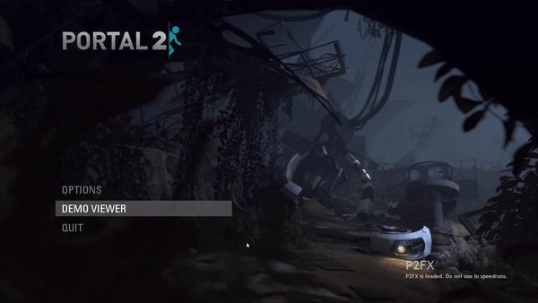
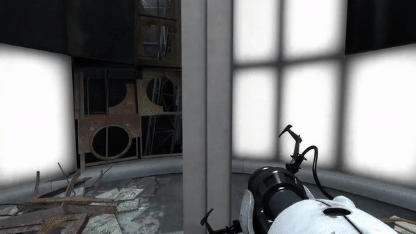
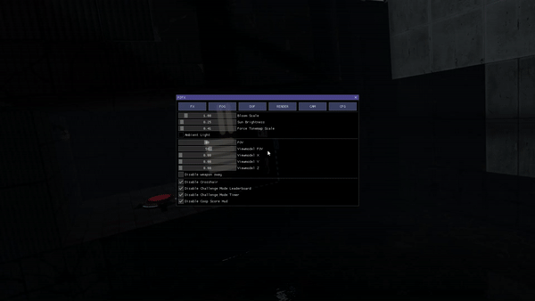

 

# P2FX
**P2FX** is a plugin based on [SourceAutoRecord](https://github.com/p2sr/SourceAutoRecord) for creating Portal 2 videos.

## Installation
- Download the newest release from [here](https://github.com/Zyntex1/p2fx/releases).
- Place it next to Portal 2's executable (typically in `SteamLibrary/steamapps/common/Portal 2`).
- Add `+mat_hdr_level 3` to the game's launch options (or else some effects will not work).
- Open the game and type `plugin_load p2fx` in the console.

## Support
**P2FX** currently does not support any operating system other than **Windows**. The plugin only works on Portal 2, no other modifications. **P2FX** is not intended to be used with any other plugins loaded.

## Features
- Play demos straight from the menu

- Easily change between demos

- Intuitively create cinematic shots

- Easy Lighting, Fog, and DOF editor

- Save your camera paths and settings with P2FX's config system

## Contributing
If you want to contribute to the project, feel free to fork the repo and create a pull request.

Take a look at [SAR's Contributing Guide](https://github.com/p2sr/SourceAutoRecord/blob/master/docs/contributing.md) for more information on how to build the project etc. (it's the same)